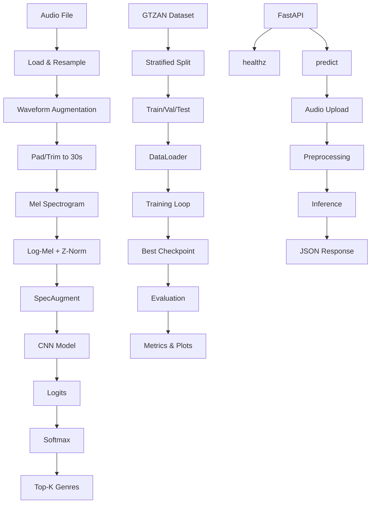

# GenreNet

A music genre classification system using log-mel spectrograms and CNNs, trained on the GTZAN dataset.

## Overview

Implements a CNN-based classifier for music genre recognition using the GTZAN dataset (10 genres, 1000 clips). The system converts audio to log-mel spectrograms and trains a compact CNN with BatchNorm, Dropout, and Adaptive Pooling for robust genre classification.

## Results

Achieves ≥80% test accuracy with moderate augmentation in ≤30 epochs.

## Architecture



## Dataset

- **GTZAN Dataset**: 10 genres × 100 clips = 1000 total audio files
- **Genres**: blues, classical, country, disco, hiphop, jazz, metal, pop, reggae, rock
- **Format**: 30-second WAV files at 22.05kHz
- **Split**: 80/10/10 train/val/test per genre (stratified)

## Quickstart

### 1. Setup Environment

```bash
python -m venv .venv && source .venv/bin/activate
pip install -r api/app/requirements.txt && pip install -e .
cp env.example .env
```

### 2. Download Data

```bash
make data
```

### 3. Sanity Check

```bash
make sanity
```

### 4. Train Model

```bash
make train
```

### 5. Evaluate

```bash
make eval
```

### 6. Export Package

```bash
make export
```

### 7. Start API

```bash
make api
```

### 8. Test API

```bash
curl -s "http://localhost:8089/healthz"
curl -s -F "file=@/path/to/your.wav" "http://localhost:8089/predict?topk=3" | jq
```

## Docker Usage

### Build and Run with Docker Compose

```bash
make compose-up
```

### Individual Services

```bash
# Training
make docker-train

# API
make docker-api
```

## Training Details

### Model Architecture

- **Input**: Log-mel spectrograms [1, 128, T]
- **CNN**: 4 conv blocks (32→64→128→256 channels) + BatchNorm + ReLU + MaxPool
- **Pooling**: AdaptiveMaxPool2d for variable time dimensions
- **Classifier**: 256→128→10 with Dropout(0.3)

### Augmentation

- **Waveform**: Random time stretch (0.9-1.15x), pitch shift (±2 semitones)
- **Spectrogram**: SpecAugment with frequency/time masking (p=0.3)

### Training Configuration

- **Optimizer**: Adam (lr=0.001, weight_decay=1e-4)
- **Scheduler**: Cosine annealing
- **AMP**: Automatic Mixed Precision (optional)
- **Early Stopping**: Patience=5 epochs
- **Batch Size**: 16 train, 32 eval

### Reproducibility

- Deterministic seeds (42) for Python, NumPy, PyTorch
- Fixed data splits per genre
- CUDNN deterministic mode

## API Endpoints

### Health Check

```bash
GET /healthz
```

Returns: `{"status": "ok"}`

### Genre Prediction

```bash
POST /predict?topk=3
Content-Type: multipart/form-data
```

Upload audio file and get top-k genre predictions.

Response:

```json
{
  "topk": [
    { "label": "rock", "score": 0.45 },
    { "label": "metal", "score": 0.32 },
    { "label": "pop", "score": 0.23 }
  ]
}
```

## Configuration

Key parameters in `core/config.yaml`:

```yaml
data:
  sample_rate: 22050
  duration_sec: 30
  n_mels: 128
  batch_size_train: 16
  augment: true

train:
  epochs: 15
  lr: 0.001
  amp: true
  scheduler: cosine

model:
  num_classes: 10
  dropout: 0.30
```
